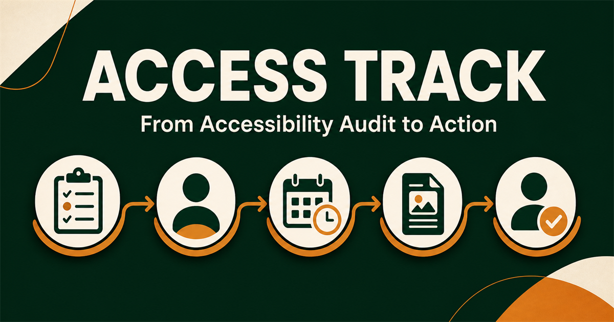

<div align="center">

# AccessTrack

**From accessibility audit to verified action.**


[Live demo](#live-demo) · [GitHub](https://github.com/Dev-hari1433/Audit-to-action) · [5-minute walkthrough](#judge-walkthrough-5-minutes)



</div>

AccessTrack is an end-to-end accessibility accountability platform for public and private buildings. The Chennai pilot shows how a citizen report becomes assigned work, photo evidence, human verification, and public proof—not a PDF that sits on a shelf.

```
Citizen report (live camera + OTP)
        ↓
Auditor review & assignment
        ↓
Building department remediates
        ↓
After-photo evidence + AI screening
        ↓
Certified auditor verification
        ↓
Closure, public badges, or escalation
```

AI can flag blurry photos and extract voice context. **AI never closes an issue.** Only a certified human auditor can approve and close work.

## Highlights

- Four purpose-built workspaces: citizen, auditor, building manager, and administrator
- Evidence-first remediation with before/after photos and multilingual voice reporting
- Human-in-the-loop verification: AI assists, certified auditors make closure decisions
- Public building scorecards, proof photos, recognition badges, and escalation history
- Full seeded Chennai demo that works without external services or API keys

---

## Live demo

| | |
|---|---|
| **Production** | *Deploying to Vercel — this README will be updated with the live URL.* |
| **Source** | [github.com/Dev-hari1433/Audit-to-action](https://github.com/Dev-hari1433/Audit-to-action) |

Use **Demo login** on the site. No password is required.

| Role | Demo persona | What to try |
|---|---|---|
| Citizen | Meena Kumar | File a report with camera, OTP, or voice |
| Auditor | Arun Selvan | Review complaints, audit buildings, verify fixes |
| Building manager | Kavitha Mani | Fix assigned issues and upload after-photos |
| Administrator | Priya Raman | Workloads, departments, rewards, and penalties |

Demo OTP: `246810`  
Use **Reset demo data** in the sidebar to restore the seeded Chennai dataset.

---

## Why this exists

Accessibility audits often stop at a score. AccessTrack keeps every finding on a lifecycle:

- **Owner** — a department is accountable
- **Deadline** — missed dates become overdue automatically
- **Evidence** — before and after photos are required
- **Verification** — a human auditor compares proof
- **Escalation** — three-level matrix when work stalls
- **Public record** — buildings, badges, and verified proof without citizen PII

---

## What each workspace does

### Citizen (`/citizen/...`, `/report`)

- Ten barrier categories: entrance steps, ramp, lift, restroom, tactile paving, wayfinding, parking, handrails, corridors, service counters
- Mandatory phone + OTP (demo code `246810`)
- Live camera capture with blur/clarity checks and multi-angle photos
- Voice reporting in English, Hindi, Tamil, Telugu, Kannada, Malayalam, Bengali, and Marathi
- Complaint IDs (`ACC-2026-XXXXXX`) with timeline and follow-ups on the same ID

### Auditor (`/auditor/...`)

- Complaints queue: accept, reject, request info, or assign
- 15-point checklist across entrance, movement, toilet, parking, and signage (Harmonised Guidelines)
- Side-by-side before/after verification: approve & close, or reject for rework
- Quarterly field reports to admin

### Building manager (`/manager/...`)

- Assigned issues by severity, department, and deadline
- Progress 0–100% with civil-works notes
- Mandatory after-photos, optional certificates, AI screening before submit

### Administrator (`/admin/...`)

- Pilot KPIs, compliance score, bottlenecks, overdue work
- Auditor workload (`LOW` → `CRITICAL`) and one-click reassignment
- Department velocity for public works, hospitals, and municipalities
- Recognition badges or warnings, notices, and penalties
- Public building directory with sanitized proof photos

---

## Stack

| Layer | Choice |
|---|---|
| App | Next.js 16 (App Router), React 19, TypeScript |
| UI | Tailwind CSS 4, Lucide |
| Maps & charts | Leaflet / OpenStreetMap, Recharts |
| Data | In-browser demo store, optional Supabase (Postgres + RLS) |
| AI | `/api/ai/analyze-photo`, `/api/ai/extract-voice`, `/api/ai/chat` — Gemini/OpenAI when keys exist, heuristic fallback otherwise |
| Voice | Web Speech API with a structured confirmation flow |

---

## Local setup

**Requires Node.js 22.13 or later.**

```bash
git clone https://github.com/Dev-hari1433/Audit-to-action.git
cd Audit-to-action
npm install
cp .env.example .env.local   # optional
npm run dev
```

Open [http://localhost:3000](http://localhost:3000).

```bash
npm run lint
npx next build
```

Without env keys the app runs in **high-fidelity demo mode** (local store + advisory AI fallbacks). Nothing extra is required to walk the full workflow.

---

## Environment

Copy `.env.example` to `.env.local` (or set the same names in Vercel → Project → Settings → Environment Variables).

| Variable | Required | Purpose |
|---|---|---|
| `NEXT_PUBLIC_SITE_URL` | Recommended in production | Canonical URL for metadata / Open Graph |
| `NEXT_PUBLIC_SUPABASE_URL` | Optional | Cloud database |
| `NEXT_PUBLIC_SUPABASE_ANON_KEY` | Optional | Supabase anon key |
| `SUPABASE_SERVICE_ROLE_KEY` | Optional | Server-side Supabase (never expose to the browser) |
| `GEMINI_API_KEY` | Optional | Vision + voice extraction |
| `OPENAI_API_KEY` | Optional | Alternate AI provider |

### Optional Supabase

1. Create a project at [supabase.com](https://supabase.com)
2. Run migrations in order:
   - `supabase/migrations/202608290001_initial_schema.sql`
   - `supabase/migrations/202608300001_full_features.sql`
3. Run `supabase/seed.sql`
4. Add the URL and keys above

---

## Judge walkthrough (~5 minutes)

1. **Report** — `/report` → live camera or upload → verify phone with `246810` → optional **Report by Voice** → submit → copy the complaint ID.
2. **Track** — `/citizen/reports` → open the complaint → add a follow-up on the same ID.
3. **Assign** — Demo login as Auditor → `/auditor/complaints` → assign to *Hospital Engineering* with a 30-day deadline.
4. **Fix** — Switch to Building Manager → `/manager/issues` → progress 100% → upload after-photo → submit for verification.
5. **Verify** — Auditor → `/auditor/verification` → compare photos → **Approve & Close Issue**.
6. **Govern** — Administrator → auditor oversight, departments, rewards & penalties.
7. **Public** — `/buildings/bld-01` or `/buildings/bld-08` as a visitor: score, badges, verified proof, no citizen contact data.

---

## Deploy on Vercel

This repository is configured for Vercel (`vercel.json` uses `next build`).

1. Import [Dev-hari1433/Audit-to-action](https://github.com/Dev-hari1433/Audit-to-action) in the [Vercel dashboard](https://vercel.com/new)
2. Framework: **Next.js**
3. Set `NEXT_PUBLIC_SITE_URL` to the production domain (for example `https://your-app.vercel.app`)
4. Optionally add Gemini/OpenAI and Supabase keys
5. Deploy — every push to `main` rebuilds production

---

## Project layout

```
app/                 Public pages, catch-all routes, AI API
components/          Role workspaces, maps, evidence, voice, AI assistant
lib/                 Demo store, geo helpers, Supabase client
supabase/            Schema, feature migration, seed data
types/               Shared TypeScript models
```

---

## License

Private / unpublished unless the repository owner adds a license. Demo data is fictional and intended for evaluation only.
